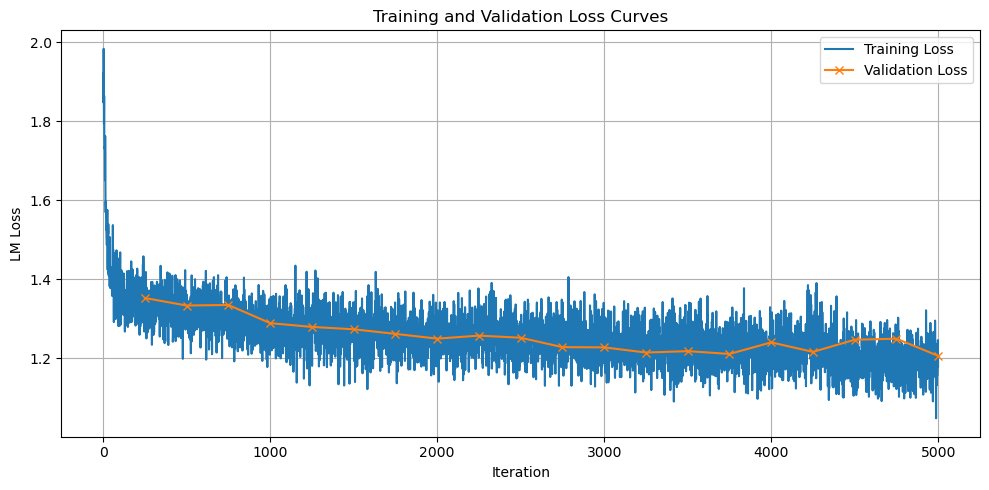

# MiniLingua 1B Supervised Fine-Tuning (SFT)

This folder contains configuration files, scripts, and notes for supervised fine-tuning (SFT) of the MiniLingua 1B model. SFT adapts the pre-trained base model to follow multilingual and multi-domain instructions, making it more useful and better aligned with user needs.

## Overview

Supervised Fine-Tuning is the second stage of model training where the goal is to adapt the model to follow instructions and perform specific tasks more effectively. The SFT process uses smaller, more carefully selected datasets compared to pre-training, focusing on instruction-response pairs across multiple languages and domains.

**Key Features**:
- **Multilingual Support**: 13 languages plus code instructions
- **Multi-Domain Coverage**: General QA, reasoning, knowledge, and coding tasks
- **Custom MCQA Dataset**: Specialized multiple-choice question answering
- **Output-Token-Only Training**: Efficient training focusing on response generation
- **Overfitting Prevention**: Careful monitoring and early stopping

## SFT Dataset Composition

### Core Multilingual Datasets

The SFT training uses a combination of established multilingual instruction datasets:

| Dataset | Languages | Description |
|---------|-----------|-------------|
| **BUFFET** | 54 | Multilingual benchmark adaptation dataset |
| **PolyglotPrompt** | 49 | Multilingual prompts adapted for benchmark tasks |
| **Bactrian-X** | 52 | Parallel multilingual dataset with 3.4M instruction-response pairs |
| **Aya** | 114 | Extensive multilingual collection of instruction-response pairs |
| **Alpaca** | 9 | Translated instruction-response pairs for supervised fine-tuning |

### Custom Multiple-Choice QA Dataset

A specialized dataset was created for multiple-choice question answering, supporting three answer formats:
- **Letter format** (40%): "A", "B", "C", "D"
- **Number format** (30%): "1", "2", "3", "4"  
- **Full answer format** (30%): Complete answer text

**Source Datasets for MCQA**:
- **ARC-Challenge**: Grade-school science questions
- **SweFAQ 2.0**: Swedish government FAQ dataset
- **Czech TruthfulQA**: Czech translation of TruthfulQA
- **INCLUDE**: Multilingual benchmark (44 languages) for knowledge and reasoning
- **EXAMS**: High school examination QA dataset with multilingual coverage

**Instruction Language Mix**:
- 30% instructions in English
- 70% instructions in target language

## Contents

Training configs presented as `.sh` scripts include batch sizes, LR schedules, optimizer choices and other parameters as a part of Megatron-LM launch script.
`token_counts.csv` presents training data distribution.
`convert.sh` script was used to convert megatron model to HF-compatible format.
`training_loss.png` gives example of the training loss dynamics while going through SFT process.
`generate_instructions.py` applies instructions to sft datasets.
`data_shuffle.py` reads sft datasets and shuffles each instructions in each file randomly.
`create_sft_mcqa.py` processes various QA datasets and create custom multi-choice QA multilingual dataset.

## Training Configuration

### Hardware Setup
| Component | Specification |
|-----------|---------------|
| **Platform** | Aalto Triton Supercomputer |
| **Compute Nodes** | 1 node |
| **GPUs** | 4 × NVIDIA H200 (141GB each) |
| **Total Memory** | 1TB system memory |
| **Storage** | High-performance scratch storage |

### Training Parameters
```yaml
# Core Training Settings
MICRO_BATCH_SIZE: 16
GLOBAL_BATCH_SIZE: 256
LEARNING_RATE: 2e-6
SEQUENCE_LENGTH: 2048
```


### Language Distribution
| Language | Percentage |
|----------|------------|
| 🇬🇧 **English** | 27% |
| 🇩🇪 **German** | 18% |
| 🇪🇸 **Spanish** | 14% |
| 🇫🇷 **French** | 13% |
| 🇮🇹 **Italian** | 7% |
| 🇵🇹 **Portuguese** | 7% |
| 🇳🇱 **Dutch** | 4% |
| 🇵🇱 **Polish** | 4% |
| 🇨🇿 **Czech** | 2% |
| 🇧🇬 **Bulgarian** | 1% |
| 🇬🇷 **Greek** | 1% |
| 🇫🇮 **Finnish** | 1% |
| 🇸🇪 **Swedish** | 1% |
| 💻 **Code** | 5% |


### Training Performance
| Metric | Value |
|--------|-------|
| **⏰ Total Time** | ~50 hours |
| **🔄 Epochs** | 1 epoch (early stopping) |
| **👣 Total Steps** | ~6,000 steps |
| **⚡ Throughput** | ~43 instructions/second |
| **🖥️ Hardware** | 4 × NVIDIA H200 GPUs |

### Training Loss Curve

The training dynamics during SFT are illustrated below, showing the convergence behavior of both training and validation loss over the course of training iterations.



## Training Environment and Setup

We trained our models using [NVIDIA Megatron-LM](https://github.com/NVIDIA/Megatron-LM), running inside the official [NGC PyTorch container](https://catalog.ngc.nvidia.com/orgs/nvidia/containers/pytorch?version=25.04-py3).

In addition, we installed [TransformerEngine](https://github.com/NVIDIA/TransformerEngine) for optimized kernels and Hugging Face libraries (`transformers`, `datasets`, `tokenizers`) for data and tokenizer support. The versions used are pinned in `requirements.txt`.

Setup follows directly from the instructions in the linked repositories, with minor environment variable adjustments needed specifically for the cluster we were working with.

After configuring the setup, you can configure `sft_configs` according to your cluster and model parameters and run them on your slurm cluster.
